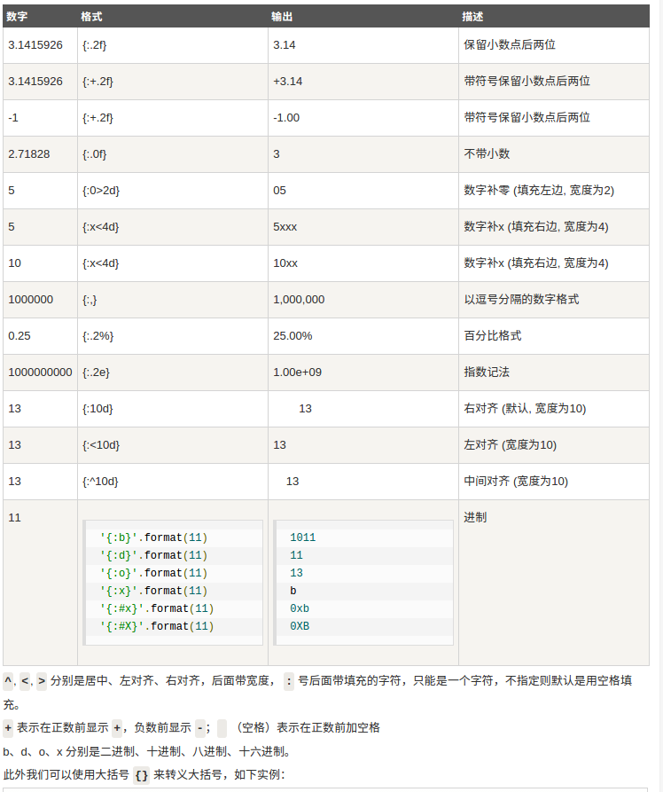

### 字符串
####  1.字符串
>##### （1）.什么是字符串
>>[字符串维基百科](https://zh.wikipedia.org/wiki/%E5%AD%97%E7%AC%A6%E4%B8%B2),简单来说`字符串（String），是由零个或多个字符组成的有限序列。。它是编程语言中表示文本的数据类型。`
>>在Python中的字符串是一种对象类型，这种类型用str表示，通常单引号`''`或者双引号`""`包裹起来。

>#####  (2).创建字符串
>>Python中使用`''`或者`""`,来创建字符串.
>>```python
>> str1 = 'Learn Python3' #使用单引号来创建
>> str2 = "Learn Python3" #使用双引号来创建
>> str1
>>'Learn Python3'
>> str2
>>'Learn Python3'
>> str3 = 'What's your name?' #此时出现3个单引号，Python解释器引起
>>  File "<stdin>", line 1       #混乱，此时要么使用转义字符，要么用双
>>    str3 = 'What's your name?' #引号包含住
>>                 ^
>>SyntaxError: invalid syntax
>>#方法一：使用双引号
>> str3 = "What's your name?"
>>#方法二：使用转义字符
>> str4 = 'what\'s your name?'
>>```

>#####  (3).拼接字符串
>
>> a.使用运算符
>>```python
>>In [2]: str1='python'
>>>>
>>In [3]: str2='3'
>>>>
>>In [4]: str1 + str2
>>Out[4]: 'python3'
>>```

>#####  (4).原始字符串
>原始转义字符`r`或`R`,可以保证字符串原貌
>>```python
>>#比如有的特殊转义字符\n,\e,直接出现在字符串中，和打印出的效果是不一样的
>>In [16]: str1='c:\news'
>>>>
>>In [17]: str1
>>Out[17]: 'c:\news'
>>>>
>>In [18]: print(str1) # /n在python中表示换行，有特殊意义
>>c:
>>ews
>>>>
>>In [19]: str2 = 'c:\\news' #使用转义字符
>>>>
>>In [20]: str2
>>Out[20]: 'c:\\news'
>>>>
>>In [21]: print(str2)
>>c:\news
>>>>
>>In [22]: print(r"c:\news") #使用原始字符r;R
>>c:\news
>>```


####  2.Python转义字符
>需要在字符中使用特殊字符时，python用反斜杠(\)转义字符.
>
>|转义字符 | 作用 |
>|--------|--------|
>| \(在行尾时) | 表示续行|
>| \' | d单引号 |
>| \\ | \ |
>| \"" | “”  |
>| \a | 表示响铃 |
>| \b |  退格(backspace) |
>| \e | 转义|
>| \000 |  空  |
>| \n |  换行  |
>| \v | 纵向制表符  |
>| \t | 横向制表符  |
>| \r | 回车  |
>| \f | 换页  |
>| \other | 其他字符以普通格式输出  |


####  3.Python字符串运算符
> #####(1).算数运算符 `+`,`*`等，字符串拼接，字符串重复
>> ```python
>>In [10]: 'hello' + 'Python' #拼接
>>Out[10]: 'helloPython'
>>>>
>>In [11]: 'hello'*3   #重复
>>Out[11]: 'hellohellohello'
>> ```

> #####(2).成员运算符
>>```python
>>In [12]: 'h' in 'hello'
>>Out[12]: True
>>
>>In [13]: 'a' not in 'hello'
>>Out[13]: True
>>```

> #####(3).支持索引,切片
>Python字符串索引是从`0`开始的，一个字符串有多少索引，可以使用内置函数`len()`来查看，切片是从索引中取出一部分值。
>>```python
>>In [16]: str1 = 'hello world'
>>>> #len()测出索引值
>>In [17]: len(str1)
>>Out[17]: 11
>>>> # 从0开始
>>In [18]: str1[0]
>>Out[18]: 'h'
>># 反向取最后一个
>>In [19]: str1[-1]
>>Out[19]: 'd'
>># 切片
>>In [20]: str1[5:8]
>>Out[20]: ' wo'
>>```

> ##### (4).字符串格式化( %)
> 维基百科的定义
> >格式化字符串，是C、C++等程序设计语言printf类函数中用于指定输出参数的格式与相对位置的字符串参数。其中的转换说明（conversion specification）用于把随后对应的0个或多个函数参数转换为相应的格式输出；格式化字符串中转换说明以外的其它字符原样输出。

>总的来说，字符串格式化，就是定制一个模板，使用占位符(%)在其中占用位置，然后在相应的位置上填充相对于的数据.
>比较常用的有`%s`,`%d`,`%f`
>>```python
>>In [24]: 'i love python %s '  % 'hhe'
>>Out[24]: 'i love python hhe '
>>>>
>>In [25]: 'i love python %d '  % 1
>>Out[25]: 'i love python 1 '
>>>>
>>In [26]: 'i love python %f '  % 1.01
>>Out[26]: 'i love python 1.010000 '
>>```


####  4.Python字符串格式化
>使用占位符`%`是老旧的做法，最好的做法是使用`str.format()`内置方法
>基本语法是通过`{}` 和 `:` 来代替以前的 `%` 。
>定义
>```python
>format(...)
>    S.format(*args, **kwargs) -> str
>>
>    Return a formatted version of S, using substitutions from args and kwargs.
>    The substitutions are identified by braces ('{' and '}').
>```
>#####  (1).`format`函数可以接受不限个参数，也可以不按照顺序.(*arg)
>```python
>#基本用法
>In [28]: "{} {}".format("hello",'world')
>Out[28]: 'hello world'
>#不按照顺序
>In [29]: '{0} {1}'.format('hello','world')
>Out[29]: 'hello world'
>#
>In [30]: '{1} {0}'.format('hello','world')
>Out[30]: 'world hello'
>#接受多个参数
>In [31]: '{0} {1} {0}'.format('hello','world')
>Out[31]: 'hello world hello'
>```

>##### (2).可以设置参数.(**kwargs)[打包，解包](./)
>```python
>In [32]: print('姓名:{name}，分数:{score}'.format(name='小明',score='70') )
>姓名:小明，分数:70
>#通过字典设置参数
>In [38]: dict1 = {'name':'小明','score':'70'}
># 使用 **解包字典
>In [39]: print('姓名:{name}，分数:{score}'.format(**dict1) )
>姓名:小明，分数:70
>#通过列表索引设置参数
>In [41]: my_list = ['小明','70']
>#
>In [42]: print("姓名:{0[0]} ,分数:{0[1]}".format(my_list))
>姓名:小明 ,分数:70
>```

>##### (3).也可以向 str.format() 传入对象
>```python
>class AssignValue(object):
>    def __init__(self, value):
>        self.value = value
>my_value = AssignValue(6)
>print('value 为: {0.value}'.format(my_value))  # "0" 是可选的
>```

>##### (4).数字格式化
>数字格式化参照下图设置
>

####  5.Python三引号
>python三引号允许一个字符串跨多行，字符串中可以包含换行符、制表符以及其他特殊字符
>```python
>para_str = """这是一个多行字符串的实例
>多行字符串可以使用制表符
>TAB ( \t )。
>也可以使用换行符 [ \n ]。
>"""
>print (para_str)
>```

####  6.Python 的字符串内建函数
>##### 概览
>>###### 字符串大小写转换
>```python
>str.capitalize()
>str.lower()
>str.casefold()
>str.swapcase()
>str.title()
>str.upper()
>```
>######字符串格式输出
>```python
>str.center(width[, fillchar])
>str.ljust(width[, fillchar]); str.rjust(width[, fillchar])
>str.zfill(width)
>str.expandtabs(tabsize=8)
>str.format(^args, ^^kwargs)
>str.format_map(mapping)
>```
>######字符串搜索定位与替换
>```python
>str.count(sub[, start[, end]])
>str.find(sub[, start[, end]]); str.rfind(sub[, start[, end]])
>str.index(sub[, start[, end]]); str.rindex(sub[, start[, end]])
>str.replace(old, new[, count])
>str.lstrip([chars]); str.rstrip([chars]); str.strip([chars])
>static str.maketrans(x[, y[, z]]); str.translate(table)
>```
>######字符串的联合与分割
>```python
>str.join(iterable)
>str.partition(sep); str.rpartition(sep)
>str.split(sep=None, maxsplit=-1); str.rsplit(sep=None, maxsplit=-1)
>str.splitlines([keepends])
>```
>######字符串条件判断
>```python
>str.endswith(suffix[, start[, end]]); str.startswith(prefix[, start[, end]])
>str.isalnum()
>str.isalpha()
>str.isdecimal(); str.isdigit(); str.isnumeric()
>str.isidentifier()
>str.islower()
>str.isprintable()
>str.isspace()
>str.istitle()
>str.isupper()
>```
>######字符串编码
>```python
>str.encode(encoding="utf-8", errors="strict")
>```

>##### 详细讲解
>###### (1).大小写转换
>>######  `str.capitalize()`
>>将首字母转换成大写，需要注意的是如果首字没有大写形式，则返回原字符串。
>>```python
>>'adi dog'.capitalize()
>># 'Adi dog'
>>
>>'abcd 徐'.capitalize()
>># 'Abcd 徐'
>>
>>'徐 abcd'.capitalize()
>># '徐 abcd'
>>
>>'ß'.capitalize()
>># 'SS'
>>```
>>######  `str.lower()[ strlower]`
>>将字符串转换成小写，其仅对 `ASCII` 编码的字母有效
>>```python
>>'DOBI'.lower()
>># 'dobi'
>>
>>'ß'.lower()   # 'ß' 为德语小写字母，其有另一种小写 'ss'， lower 方法无法转换
>># 'ß'
>>
>>'徐 ABCD'.lower()
>># '徐 abcd'
>>```
>>###### `str.casefold()`
>>将字符串转换成小写，Unicode 编码中凡是有对应的小写形式的，都会转换
>>```python
>>'DOBI'.casefold()
>># 'dobi'
>>
>>'ß'.casefold()   #德语中小写字母 ß 等同于小写字母 ss， 其大写为 SS
>># 'ss'
>>```
>>###### `str.swapcase()`
>>对字符串字母的大小写进行反转。
>>```python
>>'徐Dobi a123 ß'.swapcase()
>>#: '徐dOBI A123 SS'    这里的 ß 被转成 SS 是一种大写
>>```
>>但需要注意的是 `s.swapcase().swapcase() == s `不一定为真：
>>```python
>>u'\xb5'
>># 'µ'
>>>>>
>>u'\xb5'.swapcase()
>># 'Μ'
>>>>>
>>u'\xb5'.swapcase().swapcase()
>># 'μ'
>>>>>
>>hex(ord(u'\xb5'.swapcase().swapcase()))
>>Out[154]: '0x3bc'
>>```
>>这里 'Μ'(是 mu 不是 M) 的小写正好与 'μ' 的写法一致。
>>######  `str.title()`
>>将字符串中每个“单词”首字母大写。其判断“单词”的依据则是基于空格和标点，所以应对英文撇好所有格或一些英文大写的简写时，会出错。
>>```python
>>'Hello world'.title()
>># 'Hello World'
>>>>>
>>'中文abc def 12gh'.title()
>># '中文Abc Def 12Gh'
>>>>>
>># 但这个方法并不完美：
>>"they're bill's friends from the UK".title()
>># "They'Re Bill'S Friends From The Uk"
>>```
>>######  `str.upper()`
>>将字符串所有字母变为大写，会自动忽略不可转成大写的字符。
>>```python
>>'中文abc def 12gh'.upper()
>># '中文ABC DEF 12GH'
>>```
>>需要注意的是 s.upper().isupper() 不一定为 True。

>> ######  (2)字符串格式输出
>>>###### `str.center(width[, fillchar])`
>>将字符串按照给定的宽度居中显示，可以给定特定的字符填充多余的长度，如果指定的长度小于字符串长度，则返回原字符串。
>>```python
>>'12345'.center(10, '*')
>># '**12345***'
>>>>>
>>'12345'.center(10)
>># '  12345   '
>>```
>>###### `str.ljust(width[, fillchar]); str.rjust(width[, fillchar])`
>>返回指定长度的字符串，字符串内容居左（右）如果长度小于字符串长度，则返回原始字符串，默认填充为 ASCII 空格，可指定填充的字符串。
>>```python
>>'dobi'.ljust(10)
>># 'dobi      '
>>>>>
>>'dobi'.ljust(10, '~')
>># 'dobi~~~~~~'
>>>>>
>>'dobi'.ljust(3, '~')
>># 'dobi'
>>>>>
>>'dobi'.ljust(3)
>># 'dobi'
>>```
>>######  `str.zfill(width)`
>>用 '0' 填充字符串，并返回指定宽度的字符串。
>>```python
>>"42".zfill(5)
>># '00042'
>>"-42".zfill(5)
>># '-0042'
>>>>>
>>'dd'.zfill(5)
>># '000dd'
>>>>>
>>'--'.zfill(5)
>># '-000-'
>>>>>
>>' '.zfill(5)
>># '0000 '
>>>>>
>>''.zfill(5)
>># '00000'
>>>>>
>>'dddddddd'.zfill(5)
>># 'dddddddd'
>>```
>>###### `str.expandtabs(tabsize=8)`
>>用指定的空格替代横向制表符，使得相邻字符串之间的间距保持在指定的空格数以内。
>>```python
>>tab = '1\t23\t456\t7890\t1112131415\t161718192021'
>>
>>tab.expandtabs()
>># '1       23      456     7890    1112131415      161718192021'
>># '123456781234567812345678123456781234567812345678'  注意空格的计数与上面输出位置的关系
>>
>>tab.expandtabs(4)
>># '1   23  456 7890    1112131415  161718192021'
>># '12341234123412341234123412341234'
>>```
>>###### `str.format(^args, ^^kwargs)`
>>###### `str.format_map(mapping)`
>>类似  `str.format(*args, **kwargs)` ，不同的是 `mapping` 是一个字典对象。
>>```python
>>People = {'name':'john', 'age':56}
>>'My name is {name},i am {age} old'.format_map(People)
>># 'My name is john,i am 56 old'
>>```

>>######  (3).字符串搜索定位与替换
>>>###### `str.count(sub[, start[, end]])`
>>```python
>>text = 'outer protective covering'
>>text.count('e')
>># 4
>>text.count('e', 5, 11)
>># 1
>>text.count('e', 5, 10)
>># 0
>>```python
>>###### `str.find(sub[, start[, end]]); str.rfind(sub[, start[, end]])`
>>```python
>>text = 'outer protective covering'
>>
>>text.find('er')
>># 3
>>
>>text.find('to')
>># -1
>>
>>text.find('er', 3)
>>Out[121]: 3
>>
>>text.find('er', 4)
>>Out[122]: 20
>>
>>text.find('er', 4, 21)
>>Out[123]: -1
>>
>>text.find('er', 4, 22)
>>Out[124]: 20
>>
>>text.rfind('er')
>>Out[125]: 20
>>
>>text.rfind('er', 20)
>>Out[126]: 20
>>
>>text.rfind('er', 20, 21)
>>Out[129]: -1
>>```
>>###### `str.index(sub[, start[, end]]); str.rindex(sub[, start[, end]])`
>>与 find() rfind() 类似，不同的是如果找不到，就会引发 ValueError。
>>```python
>>str.replace(old, new[, count])
>>'dog wow wow jiao'.replace('wow', 'wang')
>># 'dog wang wang jiao'
>>
>>'dog wow wow jiao'.replace('wow', 'wang', 1)
>># 'dog wang wow jiao'
>>
>>'dog wow wow jiao'.replace('wow', 'wang', 0)
>># 'dog wow wow jiao'
>>
>>'dog wow wow jiao'.replace('wow', 'wang', 2)
>># 'dog wang wang jiao'
>>
>>'dog wow wow jiao'.replace('wow', 'wang', 3)
>># 'dog wang wang jiao'
>>str.lstrip([chars]); str.rstrip([chars]); str.strip([chars])
>>'  dobi'.lstrip()
>># 'dobi'
>>'db.kun.ac.cn'.lstrip('dbk')
>># '.kun.ac.cn'
>>
>>' dobi   '.rstrip()
>># ' dobi'
>>'db.kun.ac.cn'.rstrip('acn')
>># 'db.kun.ac.'
>>
>>'   dobi   '.strip()
>># 'dobi'
>>'db.kun.ac.cn'.strip('db.c')
>># 'kun.ac.cn'
>>'db.kun.ac.cn'.strip('cbd.un')
>># 'kun.a'
>>```
>>######`static str.maketrans(x[, y[, z]]); str.translate(table)`
>>maktrans 是一个静态方法，用于生成一个对照表，以供 translate 使用。
如果 maktrans 仅一个参数，则该参数必须是一个字典，字典的 key 要么是一个 Unicode 编码（一个整数），要么是一个长度为 1 的字符串，字典的 value 则可以是任意字符串、None或者 Unicode 编码。
>>```python
>>a = 'dobi'
>>ord('o')
>># 111
>>
>>ord('a')
>># 97
>>
>>hex(ord('狗'))
>># '0x72d7'
>>
>>b = {'d':'dobi', 111:' is ', 'b':97, 'i':'\u72d7\u72d7'}
>>table = str.maketrans(b)
>>
>>a.translate(table)
>># 'dobi is a狗狗'
>>如果 maktrans 有两个参数，则两个参数形成映射，且两个字符串必须是长度相等；如果有第三个参数，则第三个参数也必须是字符串，该字符串将自动映射到 None：
>>
>>a = 'dobi is a dog'
>>
>>table = str.maketrans('dobi', 'alph')
>>
>>a.translate(table)
>># 'alph hs a alg'
>>
>>table = str.maketrans('dobi', 'alph', 'o')
>>
>>a.translate(table)
>># 'aph hs a ag'
>>```

>>###### (4).字符串的联合与分割
>>>######`str.join(iterable)`
>>用指定的字符串，连接元素为字符串的可迭代对象。
>>```python
>>'-'.join(['2012', '3', '12'])
>># '2012-3-12'
>>
>>'-'.join([2012, 3, 12])
>># TypeError: sequence item 0: expected str instance, int found
>>
>>'-'.join(['2012', '3', b'12'])  #bytes 为非字符串
>># TypeError: sequence item 2: expected str instance, bytes found
>>
>>'-'.join(['2012'])
>># '2012'
>>
>>'-'.join([])
>># ''
>>
>>'-'.join([None])
>># TypeError: sequence item 0: expected str instance, NoneType found
>>
>>'-'.join([''])
>># ''
>>
>>','.join({'dobi':'dog', 'polly':'bird'})
>># 'dobi,polly'
>>
>>','.join({'dobi':'dog', 'polly':'bird'}.values())
>># 'dog,bird'
>>```
>>###### `str.partition(sep); str.rpartition(sep)`
>>```python
>>'dog wow wow jiao'.partition('wow')
>># ('dog ', 'wow', ' wow jiao')
>>
>>'dog wow wow jiao'.partition('dog')
>># ('', 'dog', ' wow wow jiao')
>>
>>'dog wow wow jiao'.partition('jiao')
>># ('dog wow wow ', 'jiao', '')
>>
>>'dog wow wow jiao'.partition('ww')
>># ('dog wow wow jiao', '', '')
>>
>>
>>'dog wow wow jiao'.rpartition('wow')
>>Out[131]: ('dog wow ', 'wow', ' jiao')
>>
>>'dog wow wow jiao'.rpartition('dog')
>>Out[132]: ('', 'dog', ' wow wow jiao')
>>
>>'dog wow wow jiao'.rpartition('jiao')
>>Out[133]: ('dog wow wow ', 'jiao', '')
>>
>>'dog wow wow jiao'.rpartition('ww')
>>Out[135]: ('', '', 'dog wow wow jiao')
>>```
>>###### `str.split(sep=None, maxsplit=-1); str.rsplit(sep=None, maxsplit=-1)`
>>```python
>>'1,2,3'.split(','), '1, 2, 3'.rsplit()
>># (['1', '2', '3'], ['1,', '2,', '3'])
>>
>>'1,2,3'.split(',', maxsplit=1),  '1,2,3'.rsplit(',', maxsplit=1)
>># (['1', '2,3'], ['1,2', '3'])
>>
>>'1 2 3'.split(), '1 2 3'.rsplit()
>># (['1', '2', '3'], ['1', '2', '3'])
>>
>>'1 2 3'.split(maxsplit=1), '1 2 3'.rsplit(maxsplit=1)
>># (['1', '2 3'], ['1 2', '3'])
>>
>>'   1   2   3   '.split()
>># ['1', '2', '3']
>>
>>'1,2,,3,'.split(','), '1,2,,3,'.rsplit(',')
>># (['1', '2', '', '3', ''], ['1', '2', '', '3', ''])
>>
>>''.split()
>># []
>>''.split('a')
>># ['']
>>'bcd'.split('a')
>># ['bcd']
>>'bcd'.split(None)
>># ['bcd']
>>```
>>######  `str.splitlines([keepends])`
>>字符串以行界符为分隔符拆分为列表；当 keepends 为True，拆分后保留行界符，能被识别的行界符见官方文档。
>>```python
>>'ab c\n\nde fg\rkl\r\n'.splitlines()
>># ['ab c', '', 'de fg', 'kl']
>>'ab c\n\nde fg\rkl\r\n'.splitlines(keepends=True)
>># ['ab c\n', '\n', 'de fg\r', 'kl\r\n']>>
>>
>>"".splitlines()， ''.split('\n')      #注意两者的区别
>># ([], [''])
>>"One line\n".splitlines()
>># (['One line'], ['Two lines', ''])
>>```

>>###### (5)字符串条件判断
>>###### `str.endswith(suffix[, start[, end]]); str.startswith(prefix[, start[, end]])`
>>```python
>>text = 'outer protective covering'
>>
>>text.endswith('ing')
>># True
>>
>>text.endswith(('gin', 'ing'))
>># True
>>text.endswith('ter', 2, 5)
>># True
>>
>>text.endswith('ter', 2, 4)
>># False
>>```
>>######`str.isalnum()`
>>字符串和数字的任意组合，即为真，简而言之：
>>只要 c.isalpha(), c.isdecimal(), c.isdigit(), c.isnumeric() 中任意一个为真，则 c.isalnum() 为真。
>>```python
>>dobi'.isalnum()
>># True
>>
>>'dobi123'.isalnum()
>># True
>>
>>'123'.isalnum()
>># True
>>
>>'徐'.isalnum()
>># True
>>
>>'dobi_123'.isalnum()
>># False
>>
>>'dobi 123'.isalnum()
>># False
>>
>>'%'.isalnum()
>># False
>>str.isalpha()
>>Unicode 字符数据库中作为 “Letter”（这些字符一般具有 “Lm”, “Lt”, “Lu”,“Ll”, or “Lo” 等标识，不同于 Alphabetic） 的，均为真。
>>
>>'dobi'.isalpha()
>># True
>>
>>'do bi'.isalpha()
>># False
>>
>>'dobi123'.isalpha()
>># False
>>
>>'徐'.isalpha()
>># True
>>```
>>###### `str.isdecimal(); str.isdigit(); str.isnumeric()`
>>三个方法的区别在于对 Unicode 通用标识的真值判断范围不同：
>>`isdecimal: Nd,`
>>`isdigit: No, Nd,`
>>`isnumeric: No, Nd, Nl`
>>digit 与 decimal 的区别在于有些数值字符串，是 digit 却非 decimal ，具体戳 [这里](https://www.webucator.com/blog/2015/02/python-isdigit-vs-isdecimal/)
>>```python
>>num = '\u2155'
>>print(num)
>># ⅕
>>num.isdecimal(), num.isdigit(), num.isnumeric()
>># (False, False, True)
>>
>>num = '\u00B2'
>>print(num)
>># ²
>>num.isdecimal(), num.isdigit(), num.isnumeric()
>># (False, True, True)
>>
>>num = "1"  #unicode
>>num.isdecimal(), num.isdigit(), num.isnumeric()
>># (Ture, True, True)
>>
>>num = "'Ⅶ'"
>>num.isdecimal(), num.isdigit(), num.isnumeric()
>># (False, False, True)
>>
>>num = "十"
>>num.isdecimal(), num.isdigit(), num.isnumeric()
>># (False, False, True)
>>
>>num = b"1" # byte
>>num.isdigit()   # True
>>num.isdecimal() # AttributeError 'bytes' object has no attribute 'isdecimal'
>>num.isnumeric() # AttributeError 'bytes' object has no attribute 'isnumeric'
>>```
>>######  `str.isidentifier()`
>>判断字符串是否可为合法的标识符。
>>```python
>>'def'.isidentifier()
>># True
>>'with'.isidentifier()
>># True
>>
>>'false'.isidentifier()
>># True
>>
>>
>>'dobi_123'.isidentifier()
>># True
>>
>>'dobi 123'.isidentifier()
>># False
>>
>>'123'.isidentifier()
>># False
>>str.islower()
>>'徐'.islower()
>># False
>>
>>'ß'.islower()   #德语大写字母
>># False
>>
>>'a徐'.islower()
>># True
>>
>>'ss'.islower()
>># True
>>
>>'23'.islower()
>># False
>>
>>'Ab'.islower()
>># False
>>```
>>###### `str.isprintable()`
>>判断字符串的所有字符都是可打印字符或字符串为空。Unicode 字符集中 “Other” “Separator” 类别的字符为不可打印的字符（但不包括 ASCII 的空格（0x20））。
>>```python
>>'dobi123'.isprintable()
>># True
>>
>>'dobi123\n'.isprintable()
>>Out[24]: False
>>
>>'dobi 123'.isprintable()
>># True
>>
>>'dobi.123'.isprintable()
>># True
>>
>>''.isprintable()
>># True
>>str.isspace()
>>判断字符串中是否至少有一个字符，并且所有字符都是空白字符。
>>
>>In [29]: '\r\n\t'.isspace()
>>Out[29]: True
>>
>>In [30]: ''.isspace()
>>Out[30]: False
>>
>>In [31]: ' '.isspace()
>>Out[31]: True
>>```
>>###### str.istitle()
>>判断字符串中的字符是否是首字母大写，其会忽视非字母字符。
>>```python
>>'How Python Works'.istitle()
>># True
>>
>>'How Python WORKS'.istitle()
>># False
>>
>>'how python works'.istitle()
>># False
>>
>>'How Python  Works'.istitle()
>># True
>>
>>' '.istitle()
>># False
>>
>>''.istitle()
>># False
>>
>>'A'.istitle()
>># True
>>
>>'a'.istitle()
>># False
>>
>>'甩甩Abc Def 123'.istitle()
>># True
>>```
>>###### `str.isupper()`
>>```python
>>'徐'.isupper()
>># False
>>
>>'DOBI'.isupper()
>>Out[41]: True
>>
>>'Dobi'.isupper()
>># False
>>
>>'DOBI123'.isupper()
>># True
>>
>>'DOBI 123'.isupper()
>># True
>>
>>'DOBI\t 123'.isupper()
>># True
>>
>>'DOBI_123'.isupper()
>># True
>>
>>'_123'.isupper()
>># False
>>```

>>######(6)字符串编码
>>######`str.encode(encoding="utf-8", errors="strict")`
>>```python
>>fname = '徐'
>>
>>fname.encode('ascii')
>># UnicodeEncodeError: 'ascii' codec can't encode character '\u5f90'...
>>
>>fname.encode('ascii', 'replace')
>># b'?'
>>
>>fname.encode('ascii', 'ignore')
>># b''
>>
>>fname.encode('ascii', 'xmlcharrefreplace')
>># b'&#24464;'
>>
>>fname.encode('ascii', 'backslashreplace')
>># b'\\u5f90'
>>```
