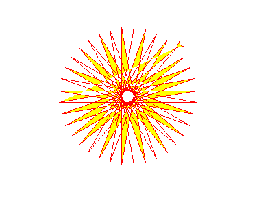
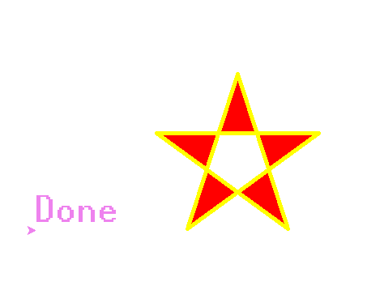

[TOC]
##内置库`turtle`
###1.文档
#### 官方文档
>[官方文档](https://docs.python.org/3/library/turtle.html#module-turtle)

###2.基础知识
>`tutle`库是Python语言中的一个绘制图像的函数库，想象是一个小乌龟，在一个横轴为x,轴为y的坐标系原点，(0,0)位置开始，它根据一组函数指令的控制，在这个平面坐标系中移动，从而在它爬行的路径上绘制了图形。
####1.画布(canvas)
> 画布就是`tutle`为我们展开的用于绘画的区域，我们可以设置它的大小和初始值。
> 设置画布大小
> `turtle.screensize(canvwidth=None,canvheight=None,bg=None)`,参数分别是 画布的宽(像素)，高，背景颜色
>```python
>turtle.secreen(800,600,"green")
>#返回默认大小(400,300)
>turtle.secreen()
>turtle.setup(width=0.5, height=0.75, startx=None, starty=None)
>#Set the size and position of the main window.
>#Arguments:
>#width: as integer a size in pixels, as float a fraction of the Default is 50% of  float设置占据屏幕的比例
>#height: as integer the height in pixels, as float a fraction of the Default is 75% of
>#(startx, starty): 这一坐标表示矩形窗口左上角顶点的位置, 如果为空,则窗口位于屏幕中心。
>#startx: if positive, starting position in pixels from the left edge of the screen, if negative from the right edge Default, startx=None is to center window horizontally.
>#starty: if positive, starting position in pixels from the top edge of the screen, if negative from the bottom edge Default, starty=None is to center window vertically.
>```

>####2.画笔
>#####2.1画笔的状态
> 在画布上默认有一个坐标原点为画布中心的坐标轴，坐标原点上有一只面朝x轴正方向的小乌龟，我们在描述时使用了两个关键词，*位置*(坐标原点)，*方向*(x轴的正方向)，`turtle`绘图，就是使用位置和方向描述小乌龟(画笔)的状态。

>#####2.2画笔的属性
>画笔的属性，颜色，画线的宽度等等
>
>|属性值 | 解释 |
>|-----|--------|
>|1).`turtle.pensize()` | 设置画笔的宽度|
>|2).`turtle.pencolor()` | 没有参数传入，返回当前画笔颜色<br>,传入参数设置画笔颜色|
>|3). `turtle.speed()` | 设置画笔的移动速度，范围为[0,10]整数，越大速度越快
>
>#####2.3绘图命令
>操作海龟有许多的命令，这些命令可以划分为3种，运动命令，画笔控制命令，全局控制命令
>######画笔运动命令
>
>| 命令 | 说明|
>|--------|----------|
>|` turtle.forward(distance)`| 向当前画笔方向移动`distance`长度 |
>|`turtle.backward(distance)`|向当前画笔的反方向移动`distance`长度|
>|`turtle.right(degree)`|顺时针移动`degree`度数|
>|`turtle.left(degree)` | 逆时针方向移动`degree`度数
>|`turtle.pendown()`|把笔放下，移动时绘制图形|
>|`turtle.penup` |提起笔移动，不绘制图形，用于另起一个地方绘制|
>|`turtle.goto(x,y)` | 将画笔移动到坐标点 (x,y)处 |
>|`turtle.circle(radius, extent=None, steps=None)` |画圆，半径为radius|
>|`setx()`|将当前x轴移动到指定位置 |
>|`sety()`|将当前y轴移动到指定位置|
>|`setheading(angle)`|设置当前朝向为 angle角度
>|`turtle.home()` | 设置当前画笔为原点，朝向为东|
>|`turtle.dot(r)` | 绘制一个指定直径和颜色的圆点|

>######画笔控制命令
>
>|命令  |  说明  |
>|-------------| --------- |
>|`turtle.fillcolor()` | 绘制图形的填充颜色 |
>|`turtle.color(color1,color2)`|同时设置pencolor=color1,fillcolor=color2|
>|`turtle.filling()` | 返回当前填充状态|
>|`turtle.begin_fill()` | 开始填充|
>|`turtle.end_fill()` | 填充结束|
>|`turtle.hideturtle()` | 隐藏画笔的turtle形状|
>|`turtle.showturtle()`| 显示画笔的turtle形状 |

>######全局控制命令
>
>|命令 | 说明 |
>|-------------|----------------|
>|`turtle.clear()` | 清空turtle窗口，但是turtle的位置和状态不会改变|
>|`turtle.reset()` |清空窗口，重置turtle状态为起始状态 |
>|`turtle.uodo()` | 撤销上一个turtle动作|
>|`turtle.isvisible` | 返回当前 turtle时候可见 |
>|`turtle.stamp()` | 复制当前图形|
>|`turtle.write(s [,font=("font-name",font_size,"font_type"))`|写文本，s为文本内容，font是字体的参数，分别为字体名称，大小和类型；font为可选项，font参数也是可选项|
>|`turtle.bgcolor()`|Set or return background color of the TurtleScreen |
>|`turtle.bgpic(picname=None)`|picname – a string, name of a gif-file or "nopic", or None .Set background image or return name of current backgroundimage|


>###### 其他命令
>
>|命令|说明|
>|-----|----|
>|`turtle.mainloop()或turtle.done()` |启动事件循环 -调用Tkinter的mainloop函数。必须是乌龟图形程序中的最后一个语句。|
>|`turtle.mode(mode=None)` |设置乌龟模式（“standard”，“logo”或“world”）并执行重置。如果没有给出模式，则返回当前模式。 <br>模式 初始龟标题 正角度<br>standard 向右（东） 逆时针<br>logo   向上（北） 顺时针
>|`turtle.delay(delay=None)`| 设置或返回以毫秒为单位的绘图延迟。|
>|`turtle.begin_poly()`|开始记录多边形的顶点。当前的乌龟位置是多边形的第一个顶点。|
|`turtle.end_poly()`|停止记录多边形的顶点。当前的乌龟位置是多边形的最后一个顶点。将与第一个顶点相连。|
|`turtle.get_poly()`|返回最后记录的多边形。|
|`turtle.register_shape(name, shape=None)`|`>>>turtle.addshape(name, shape=None)`<br>There are three different ways to call this function:<br>name is the name of a gif-file and shape is None: Install the corresponding image shape.<br>>>> `screen.register_shape("turtle.gif")`<br>Note Image shapes do not rotate when turning the turtle, so they do not display the heading of the turtle!<br>name is an arbitrary string and shape is a tuple of pairs of coordinates: Install the corresponding polygon shape.<br>`>>> screen.register_shape("triangle", ((5,-3), (0,5), (-5,-3)))`<br>name is an arbitrary string and shape is a (compound) Shape object: Install the corresponding compound shape.<br>Add a turtle shape to TurtleScreen’s shapelist. Only thusly registered shapes can be used by issuing the command shape(shapename).


>####3.命令详解
>#####3.1`tutle.circle(radius, extent=None, steps=None))`
>>描述给定半径画圆
>>参数
>>`radius`:半径为正(负),表示圆心在画笔的左边(右边)画圆
>>`extent`:弧度
>>`steps (optional)` (做半径为radius的圆的内切正多边形，多边形边数为steps)

>举例：
>`circle(50)` # 整圆;
>`circle(50,steps=3)` # 三角形;
>`circle(120, 180)` # 半圆
>######实例：太阳花
>######代码[代码](../code/turtle_practice.py)
>
>###### 五角星
>
>###### 时钟
>
