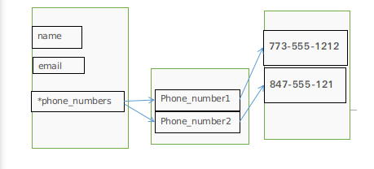
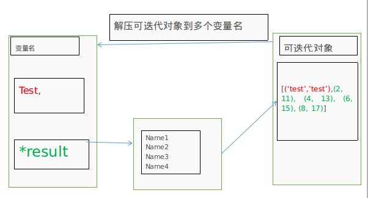

### 语句
#### 什么是语句
>为了能够严谨地阐述这个概念，抄一段维基百科中的词条：[命令式编程](https://zh.wikipedia.org/wiki/%E6%8C%87%E4%BB%A4%E5%BC%8F%E7%B7%A8%E7%A8%8B)
>>命令式编程（英语：Imperative programming），是一种描述电脑所需作出的行为的编程范型。几乎所有电脑的硬件工作都是指令式的；几乎所有电脑的硬件都是设计来运行机器码，使用指令式的风格来写的。较高级的指令式编程语言使用变量和更复杂的语句，但仍依从相同的范型。
运算语句一般来说都表现了在存储器内的数据进行运算的行为，然后将结果存入存储器中以便日后使用。高级命令式编程语言更能处理复杂的表达式，可能会产生四则运算和函数计算的结合。


#### 基本语句
>一般所有高级语言，都包含如下语句，Python也不例外：
>>#####循环语句:
>>容许一些语句反复运行数次。循环可依据一个默认的数目来决定运行这些语句的次数；或反复运行它们，直至某些条件改变。
>>#####条件语句:
>>容许仅当某些条件成立时才运行某个区块。否则，这个区块中的语句会略去，然后按区块后的语句继续运行。
>>#####无条件分支语句
>>容许运行顺序转移到程序的其他部分之中。包括跳跃（在很多语言中称为Goto）、副程序和Procedure等。

#### 重要语句
#####`import`语句
>python中有很多内置或其他的模块，可以使用`import`语句导入到python中
>有2中基本的形式
>`import　Ｘ`或者`from x import Y`，这两个语句是等价的


##### 赋值语句
> 把变量和内存中的数据连接起来
> 基本的赋值语句类似　`a = 2`
> 赋值给多个变量，解压可迭代对象赋值给多个变量
>```python
>#赋值给多个变量
>In [193]: a , b , c = (4,5,6)
>
>In [194]: print(a,b,c)
>4 5 6
>
>In [195]: a,b,c = [1,2,3]
>
>In [196]: print(a,b,c)
>1 2 3
>>＃解压可迭代对象赋值给多个变量
>In [198]: a,*b=(1,2,3,4,5)
>
>In [199]: print(a,b)
>1 [2, 3, 4, 5]
>
>In [200]: *a,b=(1,2,3,4)
>
>In [201]: print(a,b)
>[1, 2, 3] 4
>```
>解压可迭代对象赋值给多个变量的图解
>
>

##### 条件语句`if`
>基本形态
>```python
>if 表达式1:
>    语句
>elif 表达式2:
>    语句
>	.
>	.
>elif 表达式n:
>	语句
>else:
>    语句
>```
>嵌套`if`
>```python
>if 表达式1:
>    语句
>    if 表达式2:
>        语句
>    elif 表达式3:
>        语句
>    else:
>        语句
>elif 表达式4:
>    语句
>else:
>    语句
>```
>三元表达式
>三元操作，是条件语句中比较简练的一种赋值方式
>```python
>#变量名　= '语句　if 条件表达式　else 语句'
>A = Y if X else Z
>#如果X为真，那么就执行A=Y
>#如果X为假，就执行A=Z
>```
>简单练习
>求一个数是否可以整除２和３
>```python
>num = int(input("输入一个大于０的整数:"))
>if num % 2 == 0:
>	if num % 3 ==0:
>		print("{}　能整除２和３".format(num))
>	else:
>		print("{}　能整除２不能整除３".format(num))
>else:
>	if num % 3 ==0:
>		print("{}　能整除3不能整除２".format(num))
>	else:
>		print("{}　不能整除２不能整除３".format(num))
>```

#####  循环语句 `while`,`for`
>循环语句的结构控制如图<br>
>###### `while`循环
>>###### 语句的一般形式:
>>```python
>>while 判断条件:
>>	语句
>>```
>>实例，计算1-100的总和
>>```python
>>i = j = 0
>>while i < 101:
>>	j = i+j
>>	i += 1
>>print('和为{}'.format(j))
>>```
>>###### 无限循环
>>通过设置条件为`true`来实现无限循环，这在服务器的客户端上实时请求，非常有效
>>```python
>>var = 1
>>while var == 1:
>>	num = input('请输入一个值:')
>>	print("你输入的值是{}".format(num))
>>print('byebye')
>>```
>>###### `while`循环使用`else`语句
>>当`while...else..`条件为`false`时，会执行`else`语句
>>```python
>>In [206]: count = 0
>>In [208]: while count < 5:
>>     ...:     print(count,'小于5')
>>     ...:     count += 1
>>     ...: else:
>>     ...:     print(count,'大于等于5')
>>     ...:     
>>0 小于5
>>1 小于5
>>2 小于5
>>3 小于5
>>4 小于5
>>5 大于等于5
>>```
>>###### 简单语句组
>>类似与`if`的三元表达式，如果`while`只有一个语句，可以把该语句与`while`写在同一行
>>`while True:print('Hello world')`

>######`for`语句
>>`for`循环可以遍历任何序列的项目,比如一个列表，元组，字符串，
>>`for`循环的格式如下
>>```python
>>for <varialbe> in <sequence>:
>>	<statements>
>>else:
>>	<statements>
>>```
>>```python
>>languages = ["C", "C++", "Perl", "Python"]
>> for x in languages:
>>...      print (x)
>>...
>>C
>>C++
>>Perl
>>Python
>>>
>>```

>###### `break`和`continue`语句及循环中的`else`子句】
>>循环控制语句
>>
>>| 控制语句 | 描述 |
>>|--------|--------|
>>|break |在语句执行过程中终止循环，并且跳出整个循环体,任何对应的else语句都将不执行 |
>>|continue|在语句执行过程中终止本次循环，并且跳出该次循环，执行下一次循环|
>>|pass|pass是空语句，为了保持程序结构的完整性|
>>```python
>>"""
>>break终止循环语句，并且跳出循环语句块
>>"""
>>for letter in 'Runoob':
>>    if letter == 'b':
>>        break
>>    print("当前字母为:",letter)
>>>>
>>var = 10
>>while var > 0:
>>    print("当前变量值为：",var)
>>    var -= 1
>>    if var == 5:
>>        break
>>print("good bye")
>>"""
>>当前字母为: R
>>当前字母为: u
>>当前字母为: n
>>当前字母为: o
>>当前字母为: o
>>当前变量值为： 10
>>当前变量值为： 9
>>当前变量值为： 8
>>当前变量值为： 7
>>当前变量值为： 6
>>跳出了整个循环体，后面的没有再次执行了
>>"""
>>#continue跳出本次循环，执行下次循环
>>>>
>>for letter in 'Runoob':  # 第一个实例
>>    if letter == 'o':  # 字母为 o 时跳过输出
>>        continue
>>    print('当前字母 :', letter)
>>>>
>>var = 10  # 第二个实例
>>while var > 0:
>>    var = var - 1
>>    if var == 5:  # 变量为 5 时跳过输出
>>        continue
>>    print('当前变量值 :', var)
>>print("Good bye!")
>>'''
>>当前字母 : R
>>当前字母 : u
>>当前字母 : n
>>当前字母 : b
>>当前变量值 : 9
>>当前变量值 : 8
>>当前变量值 : 7
>>当前变量值 : 6
>>当前变量值 : 4
>>当前变量值 : 3
>>当前变量值 : 2
>>当前变量值 : 1
>>当前变量值 : 0
>>跳出了本次循环，执行了下次循环
>>'''
>>```

>######  `zip`简化循环语句
>>比如这个问题：
>问题:有两个列表，分别是`a=[1,2,3,4,5]`,`b=[9,8,7,6,5]`,求这两个列表相对应元素的和
>解析:由于`a``b`长度相等，可以使用其索引进行运算，求出结果
>`c = [a[i]+b[i] for i in range(len(a)) ]`
>当然可以使用另外一种方法`zip`来进行计算
>先看一下`zip`的文档，是这样描述的
>```python
>zip(iter1 [,iter2 [...]]) --> zip object
>Return a zip object whose .__next__() method returns a tuple where the i-th element comes from the i-th iterable argument.
>The .__next__() method continues until the shortest iterable in the argument sequence is exhausted and then it raises StopIteration.
>```
>`zip`生成的是一个`zip`对象，作用的是1到多个可迭代对象，生成的是一个一一对应的`tuple`,匹配的是最短的值
>>
>>```python
>>In [260]: a
>>Out[260]: [1, 2, 3, 4, 5]
>>
>>In [261]: b
>>Out[261]: [9, 8, 7, 6, 5]
>>#生成一一对应的zip对象
>>In [262]: list(zip(a,b))
>>Out[262]: [(1, 9), (2, 8), (3, 7), (4, 6), (5, 5)]
>>#作用与字典时，只会作用与键
>>In [263]: s = {'lang':'python','name':'Jack'}
>>
>>In [264]: list(zip(s))
>>Out[264]: [('name',), ('lang',)]
>>#不等长时，以最短为依据
>>In [265]: a1 = [1,2,3]
>>
>>In [266]: b1 = [1,12,3,223,232]
>>
>>In [267]: list(zip(a1,b1))
>>Out[267]: [(1, 1), (2, 12), (3, 3)]
>>```
>>对于上一个问题，`zip`的解法
>>```python
>>In [276]: d = [ x+y for x,y in list(zip(a,b))]
>>In [277]: d
>>Out[277]: [10, 10, 10, 10, 10]
>>```

>>解释一下为什么x,y可以直接代替list(zip(a,b))这个列表中的元组的两个值，这个来源也是，解压序列赋值给多个变量
>>
>>```python
>>In [271]: l1,l2,l3=[1,2,(1,2)]
>>
>>In [272]: print(l1,l2,l3)
>>1 2 (1, 2)
>>In [274]: ll1,ll2,(ll3,ll4) =[1,2,(1,2)]
>>
>>In [275]: print(ll1,ll2,ll3,ll4)
>>1 2 1 2
>>```
>>走向图

>>
>>对于`zip`而言它还可以解包
>>```python
>>In [295]: result
>>Out[295]: [(2, 11), (4, 13), (6, 15), (8, 17)]
>>
>>In [296]: list(zip(*result))
>>Out[296]: [(2, 4, 6, 8), (11, 13, 15, 17)]
>>```
>>根据解压可迭代对象给多个变量
>>
>>```python
>>In [290]: result
>>Out[290]: [(2, 11), (4, 13), (6, 15), (8, 17)]
>>
>>In [291]: print(*result)
>>(2, 11) (4, 13) (6, 15) (8, 17)
>>
>>In [292]: name1,name2,name3,name4 = result
>>
>>In [293]: print(name1,name2,name3,name4)
>>(2, 11) (4, 13) (6, 15) (8, 17)
>>
>>In [294]: list(zip(name1,name2,name3,name4))
>>Out[294]: [(2, 4, 6, 8), (11, 13, 15, 17)]
>>```
>>延伸一个问题：有一个字典，`myinfor = {"name":"qiwsir", "site":"qiwsir.github.io", "lang":"python"}`，将这个字典变换成：`infor = {"qiwsir":"name", "qiwsir.github.io":"site", "python":"lang"}`
>>```python
>> dict(zip(myinfor.values(), myinfor.keys()))
>>{'python': 'lang', 'qiwsir.github.io': 'site', 'qiwsir': 'name'}`
>>```

>######`enumerate`简化循环
>>```python
 >>  enumerate(iterable[, start]) -> iterator for index, value of iterable Return an enumerate object.
>>iterable must be another object that supports iteration.
>>The enumerate object yields pairs containing a
>> count (from start, which defaults to zero) and
>>a value yielded by the iterable argument.enumerate
>>is useful for obtaining an indexed list:(0, seq[0]), (1, seq[1]), (2, seq[2]), ...
>>```
